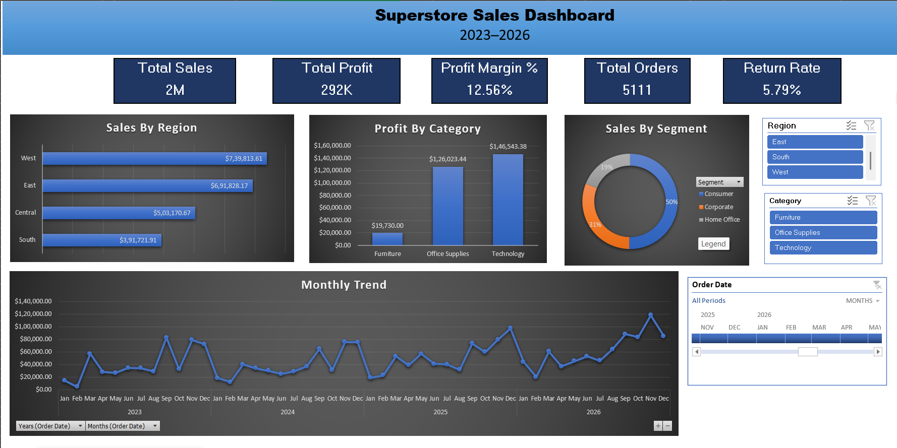

# Superstore Sales Dashboard — Excel Project

## Project Overview
An interactive sales performance dashboard built in Excel using 
real US retail data from 2023–2026.

## Dataset
- Source: Sample Superstore Dataset
- Records: 10,194 rows after cleaning
- Columns: 21 fields covering orders, customers, products and financials

## Data Cleaning
- Identified and removed 55,340 duplicate rows
- Added calculated columns: Month, Year, Profit Margin %
- Formatted currency, dates and percentages consistently

## Dashboard Features
- 5 KPI cards: Total Sales, Profit, Margin %, Orders, Return Rate
- 3 charts: Sales by Region, Profit by Category, Sales by Segment
- 1 trend chart: Monthly Sales across 4 years
- Interactive slicers: filter by Region, Category and Segment
- Timeline filter: filter by date range

## Key Insights
- West region leads with $754K in sales (32% of total revenue)
- Technology has the highest profit margin at 17.4%
- Consumer segment drives 51% of total revenue
- Return rate is well controlled at 5.8%
- Sales show consistent year on year growth from 2023 to 2025

## Tools Used
- Microsoft Excel
- Pivot Tables
- Pivot Charts
- Slicers and Timeline filters
- Conditional Formatting

## Preview

## Author
Pratiksha Yadav — Aspiring Data Analyst
